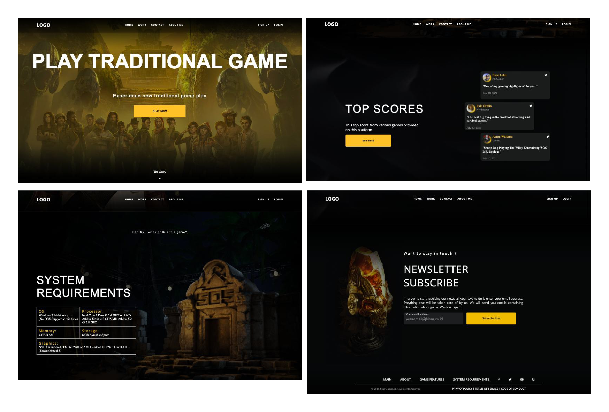

## Landing Page Traditional Game
My task is to build out this Web Landing Page Traditional Game and get it looking as close to the design as possible.

> **Notes**:
> - Build with HTML, CSS and JavaScript
> - Create responsive design for desktop and mobile
> - Push and deploy your project

[Figma Design](https://www.figma.com/design/yg4Js7RVhTVVFZ0NRh5Xut/RTB-Batch-%231---%5BAssignment%5D-Landing-Page-Traditional-Game?node-id=0-1&t=BxyYePgp7i0fLAee-0)

## Deployment

For this assigment, deployment web at Netlify :
- [Netlify](https://app.netlify.com/)
- [Deploy App](https://landingpage-rama.netlify.app/)

## Stack

Summary of what the stack looks like now including a picture with the core tech:

* **Front-end** - HTML, CSS, Javascript

